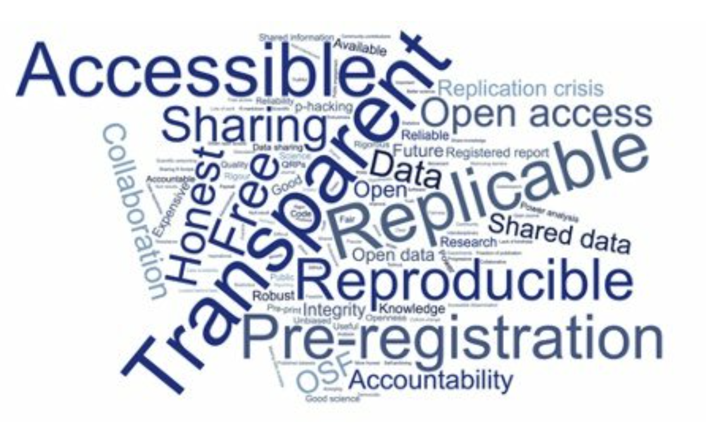

# Welcome to DUST 2025 Open Science Training

<figure markdown="span">
  { width="600" }
  <figcaption>Open Science encompasses many interconnected practices and principles</figcaption>
</figure>

## About This Training

Welcome to the DUST 2025 Open Science Training program, designed specifically for graduate students and researchers at the **University of Arizona DUST Superfund Research Center**. This comprehensive training consists of three carefully designed 50-minute lessons that will guide you through the fundamentals of modern open science practices, data management, and ethical considerations in artificial intelligence.

!!! info "For DUST Superfund Researchers"
    The DUST Center investigates hazardous waste issues in the U.S. Southwest, focusing on arsenic and mine tailings contamination. This training incorporates examples from environmental health research, toxicology, phytoremediation, and environmental justice - directly relevant to your work on mine waste contamination and human health impacts.

    Learn more about the DUST program: [superfund.arizona.edu](https://superfund.arizona.edu/)

As an environmental health researcher studying mine tailings, arsenic exposure, lung injury, or phytoremediation, open science practices are essential for advancing public health and environmental remediation. This training will help you manage complex environmental datasets, share findings with affected communities, and use AI tools ethically in environmental health research.

## What You Will Learn

This training program covers three critical areas of modern research practice:

### :material-pillar: Lesson 1: Foundations of Open Science

Discover what open science means, why it matters, and how to implement its core principles in your research. Learn about the six pillars of open science and understand how transparency and accessibility can accelerate scientific discovery.

**Duration:** 50 minutes
**Level:** Beginner to Intermediate

[Start Lesson 1](lesson1_open_science/index.md){ .md-button .md-button--primary }

### :material-database: Lesson 2: Modern Data Management for Computational Research

Master the essential practices of research data management, including the data lifecycle, FAIR principles, and practical tools for organizing, documenting, and sharing your data. Learn how proper data management saves time, prevents errors, and amplifies research impact.

**Duration:** 50 minutes
**Level:** Beginner to Intermediate

[Start Lesson 2](lesson2_data_management/index.md){ .md-button .md-button--primary }

### :material-brain: Lesson 3: Ethics and Artificial Intelligence

Explore the ethical dimensions of AI in research, including bias, discrimination, transparency, and responsible use of AI tools. Develop critical thinking skills to evaluate AI systems and learn best practices for ethical AI integration in your work.

**Duration:** 50 minutes
**Level:** Beginner to Intermediate

[Start Lesson 3](lesson3_ai_ethics/index.md){ .md-button .md-button--primary }

## Learning Objectives

By the end of this training, you will be able to:

- Explain the core principles and practices of open science
- Apply FAIR data principles to your research projects
- Create and implement a data management plan
- Recognize and mitigate bias in AI systems
- Use AI tools ethically and responsibly in your research
- Navigate the policy landscape around open science and AI
- Leverage modern tools and platforms for reproducible research

## Who Should Take This Training?

This training is designed for:

- **DUST Superfund graduate students** studying environmental health, toxicology, and remediation
- Graduate students and postdoctoral researchers in environmental sciences
- Researchers working with mine waste contamination and human health data
- Scientists studying arsenic exposure, lung disease, or phytoremediation
- Early-career faculty in environmental health and public health
- Anyone preparing NIH Superfund Research Program proposals
- Teams collaborating on multi-site field studies with hazardous materials

## Training Structure

Each lesson follows a consistent, learner-centered structure:

### Introduction (5 minutes)
Set the context, activate prior knowledge, and preview learning objectives

### Core Concepts (25 minutes)
Deep dive into essential principles with examples, demonstrations, and explanations

### Hands-on Activity (15 minutes)
Apply what you have learned through practical exercises and group discussions

### Wrap-up (5 minutes)
Review key takeaways, assess understanding, and preview next steps

## Prerequisites

- Basic familiarity with research processes
- Access to a computer with internet connection
- Willingness to engage in discussions and activities
- No prior technical expertise required

## How to Use This Site

### Navigation

Use the top navigation bar to access different lessons and resources. Each lesson is self-contained but builds on previous concepts, so we recommend completing them in order.

### Interactive Elements

Throughout the lessons, you will find:

!!! tip "Tips and Best Practices"
    Highlighted recommendations from experienced practitioners

!!! warning "Common Pitfalls"
    Important cautions and things to watch out for

!!! question "Discussion Questions"
    Opportunities to reflect and engage with the material

!!! example "Real-World Examples"
    Concrete applications from various disciplines

### Code Examples

Code blocks include syntax highlighting and copy buttons for easy use:

```python
# Example: Creating a simple data management function
def organize_data(input_file, output_dir):
    """
    Organize research data following FAIR principles
    """
    # Implementation here
    pass
```

### Assessment Questions

Each lesson includes self-assessment questions to check your understanding:

??? question "Click to reveal assessment questions"
    Questions appear in collapsible sections like this throughout each lesson

## Getting Help

If you have questions or need clarification:

1. Review the lesson materials carefully
2. Check the [Additional Resources](resources.md) page
3. Discuss with your instructor or peers
4. Open an issue on our [GitHub repository](https://github.com/tswetnam/dust-2025)

## Acknowledgments

This training draws on excellent materials from several open science initiatives:

- [CyVerse FOSS](https://foss.cyverse.org) - Foundational Open Science Skills
- [NCEMS Pre-Summit Training](https://ncems.github.io/pre-summit-foss)
- [Introduction to GPT Workshop](https://tyson-swetnam.github.io/intro-gpt)
- [Awesome Open Science](https://tyson-swetnam.github.io/awesome-open-science)

See the [Acknowledgments](acknowledgments.md) page for detailed attribution.

## License

<a rel="license" href="http://creativecommons.org/licenses/by/4.0/"></a>

This work is licensed under a <a rel="license" href="http://creativecommons.org/licenses/by/4.0/">Creative Commons Attribution 4.0 International License</a>.

You are free to:

- **Share** - copy and redistribute the material in any medium or format
- **Adapt** - remix, transform, and build upon the material for any purpose

Under the following terms:

- **Attribution** - You must give appropriate credit, provide a link to the license, and indicate if changes were made

## Ready to Begin?

Choose your starting point:

<div class="grid cards" markdown>

-   :material-pillar:{ .lg .middle } __Lesson 1: Open Science__

    ---

    Learn the foundations of open science and why it matters for modern research

    [:octicons-arrow-right-24: Start Lesson 1](lesson1_open_science/index.md)

-   :material-database:{ .lg .middle } __Lesson 2: Data Management__

    ---

    Master the skills to manage, document, and share your research data effectively

    [:octicons-arrow-right-24: Start Lesson 2](lesson2_data_management/index.md)

-   :material-brain:{ .lg .middle } __Lesson 3: AI Ethics__

    ---

    Navigate the ethical considerations of artificial intelligence in research

    [:octicons-arrow-right-24: Start Lesson 3](lesson3_ai_ethics/index.md)

</div>

---

**Last updated:** {{ git_revision_date_localized }}
