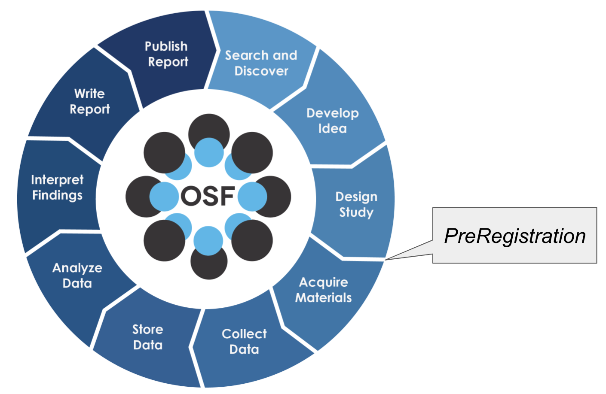

# Lesson 1: Foundations of Open Science

!!! info "Lesson Overview"
    **Duration:** 50 minutes

    **Structure:**

    - Introduction (5 min)
    - Core Concepts (25 min)
    - Hands-on Activity (15 min)
    - Wrap-up (5 min)

## Learning Objectives

!!! success "After completing this lesson, you will be able to:"
    - Define open science and explain its core components
    - Identify the six pillars of open science
    - Describe the behaviors and practices of open science
    - Explain why open science matters in education, research, and society
    - Understand both the advantages and challenges of implementing open science
    - Evaluate your own research practices against open science principles

---

## Introduction (5 minutes)

### What Brings You Here?

Take a moment to reflect:

!!! question "Self-Reflection"
    - What does "open" mean to you in the context of your research?
    - Have you encountered barriers to accessing research materials you needed?
    - What concerns do you have about sharing your own work?

### Why Open Science Matters Now

In 2023, the White House declared the Year of Open Science, joined by federal agencies and over 85 universities. While the political landscape has shifted, the fundamental principles of transparency, accessibility, and reproducibility remain critical to scientific progress.

Open science is not just an ideological movement - it is increasingly becoming a requirement:

- **Federal funders** now mandate data management plans
- **Publishers** increasingly require data and code availability
- **Universities** are recognizing open practices in promotion and tenure
- **The public** expects access to publicly-funded research

!!! example "Why Open Science Matters for DUST Research"
    **Environmental Justice** - Communities living near abandoned mine sites deserve access to research about contamination affecting their health

    **Reproducibility** - Toxicology studies on arsenic exposure must be reproducible to inform public health policy

    **Multi-site Collaboration** - DUST research spans field sites across Arizona and the Southwest, requiring transparent data sharing protocols

    **NIH Requirements** - Superfund Research Program grants require data management plans and data sharing within mandated timeframes

    **Public Health Impact** - Findings about mine tailings dust exposure and lung disease must be rapidly disseminated to protect vulnerable populations

??? tip "2025: Gold Standard Science"

    After the re-election of Donald Trump in late 2024, the White House deprecated or ended nearly all of the scientific policies of the previous administration. This includes the 2023 "Open Science" mandates.

    [Memorandums](https://www.whitehouse.gov/wp-content/uploads/2025/03/OSTP-Guidance-for-GSS-June-2025.pdf){target=_blank} by OSTP director Michael Krastios and executive orders on ["Gold Standard Science"](https://www.whitehouse.gov/presidential-actions/2025/05/restoring-gold-standard-science/){target=_blank} retain language on the principles of Open Science, though [critics argue](https://www.science.org/content/article/what-does-trump-s-call-gold-standard-science-really-mean){target=_blank} political interference and scientific gate keeping may hinder what types of science is allowed to be funded under the current administration.

    !!! quote "2025 Executive Orders"

        * [REMOVING BARRIERS TO AMERICAN LEADERSHIP IN ARTIFICIAL INTELLIGENCE, January 23, 2025](https://www.whitehouse.gov/presidential-actions/2025/01/removing-barriers-to-american-leadership-in-artificial-intelligence/){target=_blank}

        * [OMB Accelerating Federal Use of AI through Innovation, Governance, and Public Trust, April 3, 2025](https://www.whitehouse.gov/wp-content/uploads/2025/02/M-25-21-Accelerating-Federal-Use-of-AI-through-Innovation-Governance-and-Public-Trust.pdf){target=_blank}

            * [Fact Sheet: Eliminating Barriers for Federal Artificial Intelligence Use and Procurement, April 7, 2025](https://www.whitehouse.gov/fact-sheets/2025/04/fact-sheet-eliminating-barriers-for-federal-artificial-intelligence-use-and-procurement/){target=_blank}

        * [ADVANCING ARTIFICIAL INTELLIGENCE EDUCATION FOR AMERICAN YOUTH, April 23, 2025](https://www.whitehouse.gov/presidential-actions/2025/04/advancing-artificial-intelligence-education-for-american-youth/){target=_blank}

        * [Restoring Gold Standard Science, May 23, 2025](https://www.whitehouse.gov/presidential-actions/2025/05/restoring-gold-standard-science/){target=_blank}

            * [Fact Sheet: President Donald J. Trump is Restoring Gold Standard Science in America](https://www.whitehouse.gov/fact-sheets/2025/05/fact-sheet-president-donald-j-trump-deploys-advanced-nuclear-reactor-technologies-for-national-security/){target=_blank}

            * [Krastios June 23, 2025 Memorandum](https://www.whitehouse.gov/wp-content/uploads/2025/03/OSTP-Guidance-for-GSS-June-2025.pdf){target=_blank}

---

## Core Concepts (25 minutes)

### Defining Open Science

Multiple definitions exist, each emphasizing different aspects:

!!! quote "Key Definitions"
    **"Open Science is transparent and accessible knowledge that is shared and developed through collaborative networks"**

    — [Vincente-Saez & Martinez-Fuentes (2018)](https://doi.org/10.1016/j.jbusres.2017.12.043){target=_blank}

    **"Open Science is defined as an inclusive construct that combines various movements and practices aiming to make multilingual scientific knowledge openly available, accessible and reusable for everyone"**

    — [UNESCO](https://www.unesco.org/en/natural-sciences/open-science){target=_blank}

    **"A series of reforms that interrogate every step in the research life cycle to make it more efficient, powerful and accountable in our emerging digital society"**

    — Jeffrey Gillan

### The Research Life Cycle

Open science touches every stage of research:

<figure markdown>
  { width="600" }
  <figcaption>The five schools of thought in Open Science show its multidisciplinary nature</figcaption>
</figure>

Each stage offers opportunities to embrace openness:

1. **Planning** - Pre-registration, open protocols
2. **Execution** - Open notebooks, transparent methods
3. **Analysis** - Reproducible workflows, version control
4. **Dissemination** - Open access publishing, data sharing

### The Six Pillars of Open Science

Open science rests on six foundational pillars:

| **:material-pillar: Open Access** | **:material-pillar: Open Data** | **:material-pillar: Open Education** |
|:-:|:-:|:-:|
| Publications freely available to all | Research data FAIR and accessible | Educational resources open to everyone |

| **:material-pillar: Open Methodology** | **:material-pillar: Open Peer Review** | **:material-pillar: Open Source** |
|:-:|:-:|:-:|
| Transparent, reproducible methods | Review process open and attributed | Software code freely available |

??? question "How Many Pillars Are There Really?"
    The number varies from [4](https://narratives.insidehighered.com/four-pillars-of-open-science/){target=_blank} to [8](https://www.ucl.ac.uk/library/research-support/open-science/8-pillars-open-science){target=_blank} depending on the framework. Some combine categories, others separate them. What matters is understanding the principles, not memorizing a number.

#### :material-pillar: Open Access Publications

<figure markdown>
  [{ width="150" }](https://en.wikipedia.org/wiki/Open_access){target=_blank}
</figure>

!!! quote "Definition"
    "Open access is a publishing model for scholarly communication that makes research information available to readers at no cost, as opposed to the traditional subscription model"

    — [OpenAccess.nl](https://www.openaccess.nl/en/what-is-open-access){target=_blank}

**Publishing Models:**

1. **Subscription model** - Author pays little or nothing; publisher charges readers/institutions
2. **Open Access model** - Author pays publication fee; article is freely available
   - Nature Open Access: $12,290
   - PLOS ONE: $2,290

**Article Versions:**

- **Preprint** - Pre-peer review version, freely available on preprint servers
- **Author Accepted Manuscript (AAM)** - Post-peer review, pre-typesetting
- **Version of Record (VOR)** - Final published version with publisher formatting

!!! example "Preprint Repositories"
    - [arXiv](https://arxiv.org/){target=_blank} - Physics, math, computer science
    - [bioRxiv](https://www.biorxiv.org/){target=_blank} - Biology
    - [EarthArXiv](https://eartharxiv.org/){target=_blank} - Earth sciences
    - [medRxiv](https://www.medrxiv.org/){target=_blank} - Health sciences (perfect for environmental health research)
    - [engrXiv](https://engrxiv.org/){target=_blank} - Engineering (including environmental engineering)
    - [OSF Preprints](https://osf.io/preprints/){target=_blank} - Multi-disciplinary

    **DUST Example:** A study on arsenic-induced lung fibrosis mechanisms could be posted to medRxiv immediately after submission to a journal, allowing public health officials to access findings months before formal publication.

#### :material-pillar: Open Data

!!! quote "Definition"
    "Open data and content can be freely used, modified, and shared by anyone for any purpose"

    — [The Open Definition](https://opendefinition.org/){target=_blank}

Data are the foundation of science. The **FAIR Principles** guide data management:

**Findable** - Globally unique identifiers, rich metadata, searchable registries

**Accessible** - Retrievable via standard protocols, metadata persists even when data are restricted

**Interoperable** - Standard formats and vocabularies enable data integration

**Reusable** - Clear licenses, detailed provenance, community standards

!!! warning "As Open as Possible, as Closed as Necessary"
    Not all data should be open:

    - Human health data (HIPAA regulations)
    - Endangered species locations
    - Indigenous data (see CARE Principles)
    - Data that could cause harm if misused

    The **CARE Principles** for Indigenous Data Governance emphasize:

    - **C**ollective Benefit
    - **A**uthority to Control
    - **R**esponsibility
    - **E**thics

    **DUST Context:** Mine site locations near Tribal lands may require consultation with Indigenous communities. Biomarker data from residents near contaminated sites must protect participant privacy while enabling public health research. Precise GPS coordinates of endangered plant species used in phytoremediation studies should be aggregated or restricted.

#### :material-pillar: Open Educational Resources

<figure markdown>
  [{ width="200" }](https://www.unesco.org/en/communication-information/open-solutions/open-educational-resources){target=_blank}
</figure>

!!! quote "Definition"
    "Open Educational Resources (OER) are learning, teaching and research materials in any format and medium that reside in the public domain or are under copyright that have been released under an open license"

    — [UNESCO](https://www.unesco.org/en/communication-information/open-solutions/open-educational-resources){target=_blank}

**Examples of OER Providers:**

- [The Carpentries](https://carpentries.org/){target=_blank} - Foundational coding and data science
- [Project Pythia](https://projectpythia.org/){target=_blank} - Geoscience Python education
- [OER Commons](https://www.oercommons.org/){target=_blank} - Multi-disciplinary resources
- [NIEHS Training Materials](https://www.niehs.nih.gov/careers/hazmat/training){target=_blank} - Environmental health and hazardous materials

**DUST Application:** Openly sharing protocols for collecting mine tailings samples, analyzing metalloid concentrations, or conducting plant uptake experiments accelerates research across Superfund sites nationwide. Creating open training materials on working safely with arsenic-contaminated dusts benefits the entire environmental health community.

#### :material-pillar: Open Methodology

!!! quote "Definition"
    "An open methodology is one which has been described in sufficient detail to allow other researchers to repeat the work and apply it elsewhere"

    — [Watson (2015)](https://doi.org/10.1186/s13059-015-0669-2){target=_blank}

**Key Practices:**

- **Code Sharing** - GitHub, GitLab for version-controlled code
- **Protocol Publishing** - Detailed methods in protocols.io, Nature Protocols
- **Pre-registration** - Documenting analysis plans before data collection

<figure markdown>
  { width="300" }
  <figcaption>Pre-registration distinguishes hypothesis-generating from hypothesis-testing research</figcaption>
</figure>

!!! tip "Why Pre-register?"
    - Prevents p-hacking and HARKing (Hypothesizing After Results are Known)
    - Separates exploratory from confirmatory research
    - Increases credibility of findings
    - Platforms: [OSF](https://osf.io/){target=_blank}, [AsPredicted](https://aspredicted.org/){target=_blank}

    **DUST Example:** Pre-registering analysis plans for a study comparing lung injury markers between arsenic-exposed and control mice prevents selective reporting of outcomes. Documenting a phytoremediation field trial protocol before planting ensures transparent reporting of both successful and unsuccessful remediation approaches.

#### :material-pillar: Open Peer Review

Traditional peer review has limitations:

- Unreliable and inconsistent
- Delays and expense
- Lack of accountability
- Publication biases
- No incentives for reviewers

**Open peer review options:**

- Signed reviews (reviewers identity known)
- Published reviews (reviews public alongside paper)
- Reviewer participation (broader community involvement)
- Pre-print review (review before journal submission)

!!! example "Open Review Platforms"
    - [F1000Research](https://f1000research.com/){target=_blank} - Post-publication peer review
    - [PREreview](https://prereview.org/){target=_blank} - Preprint review
    - [PubPeer](https://pubpeer.com/){target=_blank} - Post-publication commenting

#### :material-pillar: Open Source Software

!!! quote "Definition"
    "Open source software is code that is designed to be publicly accessible—anyone can see, modify, and distribute the code as they see fit"

    — [Red Hat](https://www.redhat.com/en/topics/open-source/what-is-open-source){target=_blank}

    Learn more: [Open Source Initiative →](https://opensource.org/){target=_blank}

Research relies on open source:

- Linux, Python, R, Git
- Scientific libraries: NumPy, SciPy, Pandas, PyTorch
- Data platforms: Jupyter, RStudio, CyVerse
- Environmental tools: QGIS (spatial analysis), OpenAir (air quality), ChemSpider (chemical structures)

<figure markdown>
  <a href="https://xkcd.com/2347/" target="_blank">{ width="400" }</a>
  <figcaption>Modern digital infrastructure relies on open source - handle with care! [XKCD](https://xkcd.com/2347/){target=_blank}</figcaption>
</figure>

!!! example "DUST Research with Open Source"
    **X-ray Spectroscopy Analysis** - Using open-source Python libraries (lmfit, pyFAI) to analyze synchrotron data characterizing arsenic speciation in mine tailings particulate matter

    **Spatial Modeling** - QGIS and R packages (sf, terra) for mapping contamination dispersal patterns from mine sites across dryland ecosystems

    **Statistical Analysis** - R packages for analyzing dose-response relationships in toxicology experiments, with complete computational workflows shared on GitHub

    **Image Analysis** - Open-source tools (CellProfiler, ImageJ) for quantifying lung tissue damage from inhalation exposure studies

### Why Do Open Science?

[Bartling & Friesike (2014)](https://doi.org/10.1007/978-3-319-00026-8){target=_blank} identified five schools of thought (motivations):

1. **Democratic** - Making scholarship freely available to everyone
2. **Pragmatic** - Improving quality through collaboration and critique
3. **Infrastructure** - Building better platforms and tools
4. **Public** - Engaging society through citizen science and clear communication
5. **Measurement** - Developing alternative impact metrics beyond journal publications

We add a sixth:

6. **Compliance** - Meeting requirements from funders and institutions

!!! question "Discussion: Your Motivation"
    Which school resonates with you? Are there other motivations not captured here?

---

## Hands-on Activity (15 minutes)

### Open Science Self-Assessment

Work individually or in small groups to assess your current practices:

!!! question "Assessment Questions"

    **Publications**

    1. Are your published papers freely available?
    2. Do you share preprints before peer review?
    3. Have you retained rights to distribute your work?

    **Data**

    4. Where do you store your research data?
    5. Could someone else understand your data without contacting you?
    6. Have you assigned persistent identifiers (DOIs) to datasets?

    **Methods**

    7. Is your analysis code version controlled and publicly available?
    8. Could someone reproduce your analysis from your documentation?
    9. Have you pre-registered any studies?

    **Education**

    10. Do you share teaching materials under open licenses?
    11. Do you contribute to or use OER in your teaching?

    **Software**

    12. Do you contribute to open source projects?
    13. Is your research software publicly available with a license?

### Group Discussion

Share with your group:

- Which pillar of open science is strongest in your work?
- Which pillar could you improve most easily?
- What barriers prevent you from being more open?
- What would motivate you to adopt more open practices?

### Action Planning

Identify ONE concrete action you can take this month:

!!! example "Example Actions"
    - Create an ORCID profile
    - Upload a preprint to medRxiv or bioRxiv
    - Add a LICENSE file to your analysis code repository on GitHub
    - Create a data management plan for your mine tailings or toxicology project
    - Share field sampling protocols under CC-BY license
    - Deposit spectroscopy data in a domain repository with DOI
    - Pre-register your next exposure study on OSF
    - Document your image analysis pipeline in a Jupyter notebook

---

## Wrap-up (5 minutes)

### Key Takeaways

!!! success "Remember These Concepts"
    1. Open science is about **transparency, accessibility, and collaboration**
    2. The **six pillars** provide a framework for openness
    3. Open science benefits **you, your field, and society**
    4. Start with **small, practical steps** rather than perfection
    5. **As open as possible, as closed as necessary** - openness has limits

### Self-Assessment Quiz

Test your understanding:

??? question "True or False: All research papers in Nature and Science are Open Access"
    **False**

    These journals offer Open Access options but charge substantial fees ($12,000+). Authors must pay extra to make papers freely available. However, recent federal mandates require publicly-funded research to be Open Access by 2026.

??? question "True or False: Data 'available upon request' meets the definition of Open Data"
    **False**

    Open data must be freely accessible in a public repository with a persistent identifier. "Available upon request" does not meet FAIR principles as data are not findable, accessible without barriers, or guaranteed to remain available.

??? question "Using GitHub for your analysis code is an example of..."
    **Open Methodology**

    Version control systems document your computational methods transparently. This enables others to understand, verify, and build upon your work - core principles of open methodology.

??? question "If an author states their software is open source but refuses to share it, is it open source?"
    **No**

    Claiming a license without actually making the code publicly available does not make it open source. True open source software must be publicly accessible with a recognized license that permits use, modification, and distribution.

### Looking Ahead

In Lesson 2, we will put these principles into practice by learning how to:

- Manage research data throughout its lifecycle
- Create effective documentation
- Implement FAIR principles
- Write a data management plan

### Additional Resources

- [UNESCO Open Science Toolkit](https://www.unesco.org/en/open-science/about){target=_blank}
- [Foster Open Science](https://www.fosteropenscience.eu/){target=_blank}
- [The Turing Way](https://book.the-turing-way.org/){target=_blank}
- [Center for Open Science](https://www.cos.io/){target=_blank}

---

**Next:** [Lesson 2: Modern Data Management →](../lesson2_data_management/index.md)

---

**Last updated:** {{ git_revision_date_localized }}
