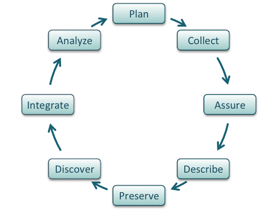

# Lesson 2: Modern Data Management for Computational Research

!!! info "Lesson Overview"
    **Duration:** 50 minutes

    **Structure:**

    - Introduction (5 min)
    - Core Concepts (25 min)
    - Hands-on Activity (15 min)
    - Wrap-up (5 min)

## Learning Objectives

!!! success "After completing this lesson, you will be able to:"
    - Recognize data as the foundation of open science
    - Describe the complete "life cycle of data"
    - Apply FAIR principles to your research data
    - Understand CARE principles for sensitive data
    - Use self-assessments to evaluate your data management practices
    - Identify tools and resources to improve data management
    - Create a basic data management plan
    - Choose appropriate licenses for your data

---

## Introduction (5 minutes)

### The Hidden Crisis in Research

!!! question "Critical Questions"
    - If you gave your data to a colleague unfamiliar with your project, could they make sense of it?
    - If you returned to your own data in five years, would you understand it?
    - When publishing, can you easily find all correct versions of your data?

!!! example "DUST Research Scenario"
    Imagine a collaborator asks you to share:

    - Arsenic concentration measurements from 50 mine tailings samples
    - Lung tissue images from an inhalation exposure study
    - Plant biomass and metal uptake data from phytoremediation field plots
    - GPS coordinates and soil characterization from multiple Superfund sites

    Could they understand your file naming conventions? Would they know which samples came from which sites? Would they understand the units, detection limits, and quality control procedures? Environmental health research generates complex, multi-dimensional datasets requiring exceptional organization.

### The Biggest Challenge

!!! danger "The #1 Data Management Problem"
    **Making it an afterthought.**

    Poor data management has no upfront cost. You can do substantial work before realizing you are in trouble. By then, fixing the problem is exponentially harder.

    **The solution?** Make data management the **first** thing you consider when starting research.

### Why Data Management Matters

**Well-managed datasets:**

- Make life much easier for you and collaborators
- Enable others to reuse and build upon your work
- Are increasingly **required** by funders and journals
- Protect against data loss and irreproducibility
- Save time and prevent costly errors

!!! info "NSF is Getting Stricter"
    Recent NSF policies require:

    - 2-page Data Management Plan (DMP) in all proposals
    - Persistent identifiers for data
    - Machine-readable DMPs
    - Privacy, IP, and reuse policies
    - Review of DMP as part of proposal merit

!!! info "NIH Superfund Program Requirements"
    NIH Superfund Research Program grants require:

    - Data Management and Sharing Plans (DMSP) describing data types, standards, preservation, and timelines
    - Data sharing within specified timeframes (often 1 year after collection or upon publication)
    - Consideration of human subjects protections for community health data
    - Documentation of sensitive data restrictions (location data for contaminated sites, participant privacy)
    - Use of appropriate repositories (EPA ScienceHub, NIEHS repositories, or domain-specific archives)

---

## Core Concepts (25 minutes)

### What Qualifies as Data?

Different data types require different management strategies:

**Data Types:**

- **Text** - Field notes, survey responses, interview transcripts
- **Numeric** - Tables, measurements, counts, statistics
- **Audiovisual** - Images, videos, sound recordings
- **Models & Code** - Simulations, algorithms, analysis scripts
- **Discipline-specific** - FASTA (biology), FITS (astronomy), CIF (chemistry)
- **Instrument-specific** - Raw equipment outputs, sensor readings

!!! example "DUST Data Types"
    **Environmental Chemistry** - ICP-MS outputs (arsenic/metalloid concentrations), XRD patterns, synchrotron XAS spectra

    **Toxicology** - Flow cytometry data, histopathology images, gene expression arrays, biomarker measurements

    **Phytoremediation** - Plant biomass measurements, metal uptake data, hyperspectral imaging, LiDAR point clouds

    **Epidemiology** - Survey responses (with PII protections), biomarker data (HIPAA-compliant), geospatial health data

    **Field Sampling** - GPS coordinates, soil cores, air quality measurements, meteorological data

**Data Sources:**

=== "Observational"
    - Captured in real-time, typically outside lab
    - **Usually irreplaceable** - most important to safeguard
    - Examples: Sensor readings, telescope observations, field surveys

=== "Experimental"
    - Generated under controlled conditions
    - Often reproducible but expensive/time-consuming
    - Examples: Lab measurements, controlled trials, sequencing

=== "Simulation"
    - Machine-generated from computational models
    - Reproducible if model and inputs preserved
    - Examples: Climate projections, molecular dynamics

=== "Derived"
    - Generated from existing datasets
    - Reproducible but potentially expensive
    - Examples: Meta-analyses, compiled databases, data mining results

### The Data Life Cycle

<figure markdown>
  { width="500" }
  <figcaption>Data flow through multiple stages, each with specific management needs</figcaption>
</figure>

Understanding where data are in their lifecycle helps plan management strategies:

#### :material-lightbulb: Plan

- Describe data to be collected
- Plan for organization before collection
- Consider all lifecycle stages
- Create Data Management Plan

!!! tip "Planning Questions"
    - What data will you generate or reuse?
    - What file formats will you use?
    - How will you organize and document data?
    - Where will data be stored and backed up?
    - How will you ensure data quality?
    - Who will have access and when?
    - How long must data be preserved?

#### :material-clipboard-check: Collect

- Implement organizational system before collecting
- Capture observation metadata simultaneously
- Take advantage of automatic metadata generation
- Use consistent naming conventions
- Document collection conditions

!!! example "File Naming Best Practices"
    ```
    # Good Examples
    2025-01-15_site-A_temp-sensor-01_raw.csv
    experiment-03_rep-02_treated_microscopy.tif
    survey_2025_wave-01_demographics.xlsx

    # Bad Examples
    data.csv
    final_FINAL_v3_revised_2.xlsx
    New Folder (2)/results!!!.csv
    ```

!!! example "DUST File Naming Examples"
    ```
    # Mine Tailings Samples
    2025-01-20_IronKing_MT-001_As-concentration_ICP-MS.csv
    2025-01-20_IronKing_MT-002_XRD-pattern_raw.xy

    # Lung Tissue Images
    exp-027_mouse-14_lung-section-03_H&E-stain_40x.tif
    exp-027_mouse-14_lung-section-03_collagen-IF_20x.tif

    # Phytoremediation Field Data
    2025-03-15_site-B_plot-12_Atriplex-canescens_biomass.csv
    2025-03-15_site-B_hyperspectral_processed_NDVI.tif

    # Keep consistent: YYYY-MM-DD_site_sample-ID_analysis-type_details.ext
    ```

#### :material-quality-high: Assure

- Record quality conditions during collection
- Distinguish estimated from measured values
- Double-check manually entered data
- Run statistical summaries to find outliers
- Flag questionable or missing values
- Perform validation checks

**Quality Assurance Checklist:**

- [ ] Define acceptable ranges for measurements
- [ ] Implement automated validation scripts
- [ ] Document calibration procedures
- [ ] Track instrument performance over time
- [ ] Create visualizations to spot anomalies
- [ ] Maintain audit trail of quality checks

#### :material-text-box: Describe

!!! quote "Metadata is Key"
    "Without thorough description of context, collection methods, measurements, and quality, data are unlikely to be discovered, understood, or effectively used."

**Essential Metadata:**

- **Dataset information** - Title, dates, version, related datasets
- **People** - Authors, affiliations, sponsors, ORCID IDs
- **Scientific context** - Research question, hypotheses, methods
- **Data details** - Variables, units, formats, missing value codes
- **Quality** - Precision, accuracy, uncertainty, QA procedures
- **Access** - License, restrictions, citation instructions

**Metadata Standards:**

- [DataCite](https://schema.datacite.org/){target=_blank} - Publishing data
- [Dublin Core](http://www.dublincore.org/){target=_blank} - Web-based sharing
- [ISO 19115](https://www.iso.org/standard/53798.html){target=_blank} - Geospatial data
- [MIxS](https://genomicsstandardsconsortium.github.io/mixs/){target=_blank} - Environmental samples (soil, water)
- [Darwin Core](https://dwc.tdwg.org/){target=_blank} - Biodiversity/ecological data
- Domain-specific standards - Check [FAIRsharing.org](https://fairsharing.org/){target=_blank}

!!! example "DUST Metadata Needs"
    **Mine Tailings Samples** - Site GPS coordinates, collection date/time, depth, weather conditions, proximity to mining activity, historical context, chain of custody

    **Toxicology Experiments** - Animal strain/source, exposure protocol (concentration, duration, route), housing conditions, institutional approvals (IACUC), treatment randomization

    **Chemical Analysis** - Instrument make/model, calibration standards, detection limits, QA/QC procedures, analyst ID, date of analysis, method references

    **Field Studies** - Plot layout, vegetation surveys, soil characterization, meteorological data, disturbance history, GPS accuracy

#### :material-archive: Preserve

!!! warning "Not Just Backup - Preservation"
    Preservation means ensuring data remain accessible and usable long-term, not just keeping copies on a hard drive.

**Preservation Repositories:**

- **Domain-specific** - [GenBank](https://www.ncbi.nlm.nih.gov/genbank/){target=_blank} (sequences), [PANGAEA](https://pangaea.de/){target=_blank} (Earth science)
- **Environmental/Health** - [EPA ScienceHub](https://www.epa.gov/sciencehub){target=_blank}, NIEHS data repositories
- **Institutional** - University libraries, research centers
- **General purpose** - [Zenodo](https://zenodo.org/){target=_blank}, [Dryad](https://datadryad.org/){target=_blank}, [Figshare](https://figshare.com/){target=_blank}
- **CyVerse** - [Data Commons](http://datacommons.cyverse.org/){target=_blank} for computational biology
- **Geospatial** - [USGS ScienceBase](https://www.sciencebase.gov/){target=_blank}, [DataONE](https://www.dataone.org/){target=_blank}

!!! example "DUST Repository Choices"
    **Toxicology Data** - Consider NIEHS Data Portal or NIH-supported repositories (dbGaP for human subjects, figshare for animal studies)

    **Environmental Chemistry** - EPA ScienceHub for data relevant to contaminated sites, or Zenodo with appropriate environmental keywords

    **Geospatial Data** - DataONE or USGS ScienceBase for mine site characterization and remediation monitoring data

    **Spectroscopy Data** - Zenodo allows large files and assigns DOIs, perfect for synchrotron XAS or hyperspectral datasets

**Preservation Best Practices:**

1. Choose repositories with [TRUST principles](https://www.nature.com/articles/s41597-020-0486-7){target=_blank}
2. Use open, non-proprietary formats when possible
3. Include comprehensive documentation
4. Assign persistent identifiers (DOIs)
5. Apply appropriate licenses
6. Consider embargo periods if needed

#### :material-magnify: Discover

Good metadata enables discovery by you and others:

- Repository search interfaces
- [Google Dataset Search](https://datasetsearch.research.google.com/){target=_blank}
- [DataOne](https://www.dataone.org/){target=_blank}
- Discipline-specific portals
- Repository aggregators

#### :material-link-variant: Integrate

- Data integration requires careful work
- Standards and ontologies are crucial
- Know the data before integrating
- Never assume column headers mean the same thing
- **Always cite data you reuse**
- Use DOIs for citations

#### :material-chart-line: Analyze

- Follow reproducible practices
- Record all software, versions, parameters
- Use computational notebooks (Jupyter, R Markdown)
- Version control analysis code
- Pre-register analysis plans when possible
- Document decision points

### FAIR Principles

In 2016, the [FAIR Guiding Principles](https://www.nature.com/articles/sdata201618){target=_blank} revolutionized how we think about data management.

<figure markdown>
  { width="500" }
  <figcaption>FAIR Principles provide a framework for data stewardship</figcaption>
</figure>

!!! tip "Why Principles, Not Rules?"
    FAIR is intentionally a set of principles, not rigid rules. Different disciplines must interpret and implement these principles appropriate to their contexts and technologies.

#### F - Findable

- (Meta)data assigned globally unique persistent identifier
- Data described with rich metadata
- Metadata includes identifier of described data
- (Meta)data registered in searchable resource

**Practical Implementation:**

- Use DOIs for datasets
- Create comprehensive README files
- Register with domain repositories
- Use descriptive, searchable keywords

#### A - Accessible

- (Meta)data retrievable via standardized protocol
- Protocol is open, free, universally implementable
- Protocol allows authentication when necessary
- Metadata accessible even when data unavailable

**Practical Implementation:**

- Store in repositories with standard access protocols (HTTP, FTP)
- Provide clear access instructions
- Maintain metadata permanently
- Document access restrictions clearly

#### I - Interoperable

- (Meta)data use formal, shared, broad language
- (Meta)data use vocabularies following FAIR principles
- (Meta)data include qualified references to other data

**Practical Implementation:**

- Use standard file formats (CSV, NetCDF, GeoTIFF)
- Apply community ontologies
- Link related datasets
- Document relationships between datasets

#### R - Reusable

- (Meta)data richly described with accurate attributes
- Released with clear, accessible usage license
- Associated with detailed provenance
- Meet domain-relevant community standards

**Practical Implementation:**

- Include comprehensive documentation
- Apply recognized license (CC-BY, CC0)
- Document data collection and processing
- Follow discipline-specific standards

!!! warning "FAIR ≠ Open"
    FAIR does not require data be open. Data can be FAIR but restricted:

    - Human subjects data may be FAIR but require access approval
    - Endangered species locations should be findable in metadata but not accessible
    - Indigenous data may be FAIR to community members but restricted to others

### CARE Principles

!!! quote "Nothing About Us Without Us"
    The [CARE Principles](https://www.gida-global.org/care){target=_blank} for Indigenous Data Governance ensure Indigenous Peoples' rights and interests in data are respected. CARE complements FAIR by centering Indigenous rights and interests in data governance.

**C - Collective Benefit**

- Data for inclusive development and innovation
- Data for improved governance and citizen engagement
- Data for equitable outcomes

**A - Authority to Control**

- Recognize Indigenous rights and interests
- Empower data for governance
- Support governance of data

**R - Responsibility**

- Foster positive relationships
- Expand capability and capacity
- Support Indigenous languages and worldviews

**E - Ethics**

- Minimize harm and maximize benefit
- Promote justice
- Consider future use

!!! tip "Applying CARE in Practice"
    When working with data about Indigenous peoples, traditional knowledge, or Indigenous lands:

    1. Engage with communities early
    2. Establish data sovereignty agreements
    3. Respect cultural protocols
    4. Share benefits equitably
    5. Support community capacity building

### Data Management Plans

!!! quote "Failure to Plan is Planning to Fail"
    A Data Management Plan (DMP) is a formal document outlining how data will be handled during and after a research project.

**Why Create a DMP?**

**Stick:** You have to - funders require them

**Carrot:** They make your life easier

- Clarify your thinking before starting
- Anticipate and avoid problems
- Budget appropriately
- Enable collaboration
- Facilitate data sharing and preservation

**Essential DMP Components:**

1. **Data Description**
   - Types, volumes, formats
   - Existing vs. new data
   - Relationship to other data

2. **Metadata & Documentation**
   - Standards to be used
   - Tools for documentation
   - Completeness of documentation

3. **Storage & Backup**
   - Short-term storage during project
   - Backup frequency and methods
   - Data security measures

4. **Access & Sharing**
   - Who can access data and when
   - How others can access data
   - Restrictions on sharing

5. **Preservation**
   - Where data will be deposited
   - How long data will be preserved
   - Costs and responsibilities

6. **Ethics & Compliance**
   - Privacy considerations
   - Intellectual property issues
   - Ethical approvals needed

!!! tip "DMP Tools"
    **[DMPTool](https://dmptool.org/){target=_blank}** - Create plans using funder templates

    **[Data Stewardship Wizard](https://ds-wizard.org/){target=_blank}** - Knowledge-based DMP creation

    Both tools provide guidance, templates, and examples to help you write effective DMPs.

### Choosing a License

By default, creative work is under exclusive copyright. To enable reuse, you must license your work.

**Common Data Licenses:**

=== "CC0 Public Domain"
    - Complete surrender of copyright
    - Data freely usable without attribution
    - Most open option
    - Recommended for maximum reuse

=== "CC-BY Attribution"
    - Requires attribution to creator
    - Allows any use with credit
    - Balances openness with recognition
    - Most common for research data

=== "CC-BY-SA Share-Alike"
    - Requires attribution
    - Derivative works must use same license
    - Ensures openness propagates
    - Less commonly used for data

!!! warning "Non-Commercial Restrictions"
    Avoid "NC" (non-commercial) licenses for research data:

    - Ambiguous definition of "commercial"
    - Restricts institutional and infrastructure use
    - Prevents integration with other datasets
    - Limits reproducibility

**Choosing a License:**

1. Check funder requirements
2. Consider community norms
3. More open = more reuse
4. Document license clearly in repository
5. Include LICENSE file with data

**Resources:**

- [Choose a License](https://choosealicense.com/){target=_blank}
- [Creative Commons License Chooser](https://creativecommons.org/choose/){target=_blank}
- [Open Data Commons Licenses](https://opendatacommons.org/licenses/){target=_blank}

---

## Hands-on Activity (15 minutes)

### Data Management Self-Assessment

Evaluate your current practices across multiple dimensions:

!!! question "Assessment: The Three Vs"

    **Volume** - Size and quantity of data

    - [ ] I know the total size of my active research data
    - [ ] I have enough storage for my data
    - [ ] I have a plan for when data exceed current storage
    - [ ] I've budgeted for data storage costs

    **Velocity** - Speed of data generation/analysis

    - [ ] I can keep up with data processing
    - [ ] I have automated workflows for routine tasks
    - [ ] Data are processed in reasonable timeframes
    - [ ] Backlogs are manageable

    **Variety** - Diversity of data types

    - [ ] I use standard file formats when possible
    - [ ] Different data types are organized logically
    - [ ] I have appropriate tools for each data type
    - [ ] Data can be integrated when needed

!!! question "Assessment: FAIR Principles"

    **Findable**

    - [ ] Data have unique identifiers
    - [ ] Metadata are comprehensive
    - [ ] Data are registered in searchable repositories
    - [ ] Identifiers are persistent (DOIs)

    **Accessible**

    - [ ] Data are stored in reliable locations
    - [ ] Access methods are documented
    - [ ] Authentication is appropriate
    - [ ] Metadata will persist long-term

    **Interoperable**

    - [ ] Standard formats are used
    - [ ] Community vocabularies are applied
    - [ ] Related datasets are linked
    - [ ] Data work with analysis tools

    **Reusable**

    - [ ] Clear license is applied
    - [ ] Provenance is documented
    - [ ] Quality is described
    - [ ] Usage guidelines are provided

### Group Exercise: DMP Scenario

Work in small groups on this scenario:

!!! example "Scenario: Mine Waste Phytoremediation Study"
    You are planning a 4-year NIH Superfund-funded study investigating arsenic uptake by native plant species at abandoned mine sites in Arizona.

    **Data to be collected:**

    - Soil samples (100+ samples/year): ICP-MS for As/metal concentrations
    - Plant tissue samples: Biomass, metal uptake, tissue distribution
    - Hyperspectral drone imagery (quarterly): Plant stress detection
    - Weather station data (15-min intervals): Temperature, humidity, precipitation
    - GPS/GIS data: Site characterization, vegetation mapping
    - Laboratory notebooks: Experimental procedures, observations
    - Microscopy images: Root structure, fungal associations

    **Project involves:**

    - 3 mine sites (some on/near Tribal lands)
    - 4 institutions (UA, ASU, external lab, Tribal consultation)
    - 10 team members (PIs, grad students, technicians, community partners)
    - NIH Superfund funding requiring DMSP
    - Data must be public 1 year after publication
    - Some location data may need restriction to prevent looting of remediation plants

**Your Task:** Draft key sections of the DMP addressing:

1. **Data types and volumes** - Estimate sizes, formats (ICP-MS output, drone imagery, etc.)
2. **Metadata** - What standards apply? (MIxS for soil samples, Darwin Core for plants, ISO 19115 for spatial data)
3. **Storage** - During project, where will data live? (Institutional storage, field backups)
4. **Quality** - How ensure accuracy? (Calibration standards, duplicate samples, QA/QC protocols)
5. **Sharing** - Timeline, repository (EPA ScienceHub? Zenodo?), restrictions for sensitive locations
6. **Roles** - Who is responsible for what? (Data manager, PI oversight, institutional compliance)
7. **Ethical considerations** - Tribal consultation, community benefit, location data sensitivity

**Discussion Points:**

- How do you balance open data with protecting sensitive site locations?
- What metadata is critical for someone to reuse your phytoremediation data?
- How do you handle data from external labs with different formats?
- What are the implications of working near/on Tribal lands?

### Individual Action Planning

Choose one improvement to implement this week:

!!! example "Possible Actions"
    - [ ] Create README template for my lab
    - [ ] Set up automated backups
    - [ ] Register for ORCID and start using it
    - [ ] Reorganize one project's file structure
    - [ ] Document one dataset with comprehensive metadata
    - [ ] Choose and apply license to existing dataset
    - [ ] Create data dictionary for current project
    - [ ] Set up version control for analysis code

---

## Wrap-up (5 minutes)

### Key Takeaways

!!! success "Remember These Concepts"
    1. **Plan early** - Data management starts before data collection
    2. **FAIR principles** provide a framework but require interpretation
    3. **CARE principles** emphasize ethics and Indigenous data sovereignty
    4. **Metadata matters** - Future you (and others) need excellent documentation
    5. **Tools exist** - DMPTool, repositories, standards can help
    6. **Start small** - One improvement at a time compounds over time

### Self-Assessment Quiz

??? question "What is the biggest challenge in data management?"
    **Making it an afterthought**

    Data management problems are not immediately obvious. You can collect substantial data before realizing organization, documentation, or backup is inadequate. By then, fixing problems is exponentially harder. Make data management the first consideration in any project.

??? question "True or False: FAIR and CARE principles are the same"
    **False**

    FAIR focuses on making data findable, accessible, interoperable, and reusable - primarily technical concerns. CARE addresses Indigenous data governance, emphasizing collective benefit, authority to control, responsibility, and ethics. Both are important but address different aspects of data stewardship.

??? question "True or False: Data available upon request meets Open Data standards"
    **False**

    Open data must be freely accessible in public repositories without requiring individual requests. "Available upon request" creates barriers, does not ensure data persist long-term, and does not meet FAIR findability or accessibility principles.

??? question "Your project needs a license allowing others to use your work with attribution. Which do you choose?"
    **CC-BY (Creative Commons Attribution)**

    CC-BY allows anyone to use, modify, and distribute your data as long as they provide appropriate attribution. This balances openness (maximizing reuse) with recognition (ensuring credit to creators). It is the most common license for research data.

### Looking Ahead

In Lesson 3, we will address ethical considerations in modern research by exploring:

- Bias and discrimination in AI systems
- Responsible use of AI tools in research
- Transparency and accountability
- Best practices for ethical AI integration

### Additional Resources

- [DataOne Best Practices](https://dataoneorg.github.io/Education/bestpractices/){target=_blank}
- [FAIR Principles](https://www.go-fair.org/fair-principles/){target=_blank}
- [CARE Principles](https://www.gida-global.org/care){target=_blank}
- [TRUST Principles](https://www.nature.com/articles/s41597-020-0486-7){target=_blank}
- [DMPTool](https://dmptool.org/){target=_blank}
- [Registry of Research Data Repositories](https://www.re3data.org/){target=_blank}

---

**Previous:** [← Lesson 1: Open Science](../lesson1_open_science/index.md) | **Next:** [Lesson 3: AI Ethics →](../lesson3_ai_ethics/index.md)

---

**Last updated:** {{ git_revision_date_localized }}
